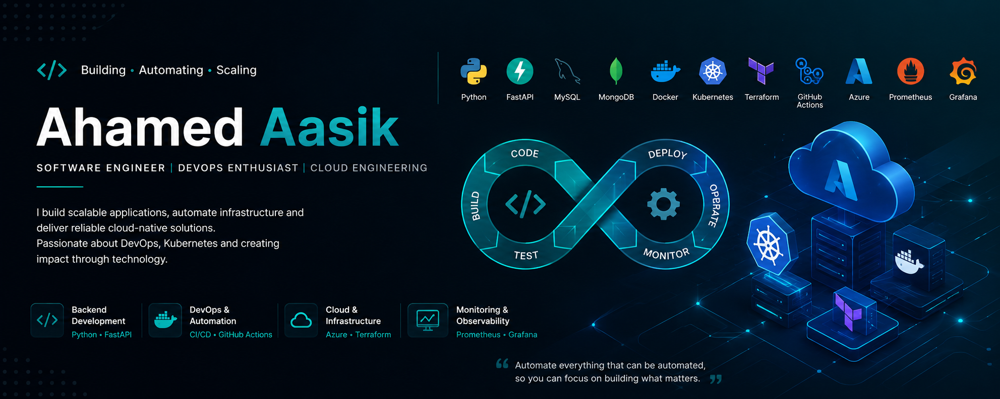

<!-- ======================================================= -->
<!--                      HEADER BANNER                      -->
<!-- ======================================================= -->

  

<h1 align="center">Hi 👋 I'm Ahamed Aasik</h1>

<h3 align="center">
Software Engineer • Backend Developer • DevOps Engineer • Cloud Enthusiast
</h3>

Building scalable APIs • Automating Infrastructure • Deploying Cloud Native Applications

---

## 🚀 About Me

I'm a Software Engineer passionate about Backend Development, DevOps, Cloud Engineering and Platform Automation.

I enjoy designing scalable systems, building production-ready APIs, automating deployments, and working with Kubernetes and cloud infrastructure.

- 🔭 Building Cloud Native Applications
- ☁️ Learning Azure Cloud Architecture
- 🐳 Exploring Kubernetes Ecosystem
- ⚙️ Automating Infrastructure using Terraform
- 📈 Interested in Observability & Platform Engineering

---

# 💻 Tech Stack

### Languages

### Backend

### Database

### DevOps

### Cloud

### Monitoring

---

# 🏗️ Current Focus

✔ Backend API Development

✔ Cloud Native Applications

✔ Kubernetes

✔ Docker

✔ Infrastructure as Code

✔ CI/CD Automation

✔ Monitoring & Observability

---

# 📌 Featured Projects

## 🚀 OpsGPT

AI-powered DevSecOps platform for intelligent incident management.

**Tech**

- FastAPI
- Docker
- Kubernetes
- Azure
- Terraform
- Prometheus
- Grafana
- GitHub Actions

---

## 🌟 More Projects

- Backend REST APIs
- Infrastructure Automation
- Kubernetes Deployments
- Dockerized Applications

---

# 📈 GitHub Stats

---

# 🔥 GitHub Streak

---

# 📊 Contribution Graph

---

# 🌱 Currently Learning

- Java
- Spring Boot
- OAuth 2.0
- Platform Engineering
- AI Agents
- System Design

---

---

⭐ Thanks for visiting my profile!

